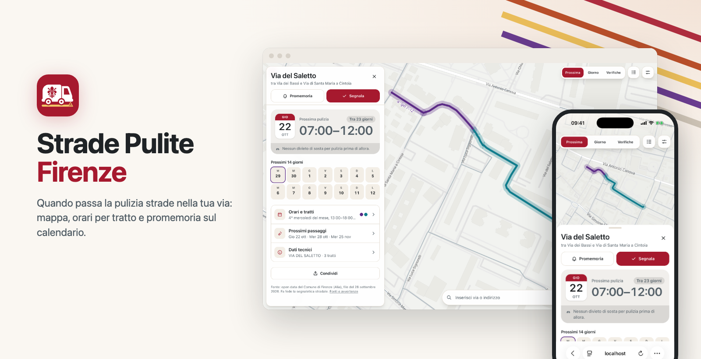
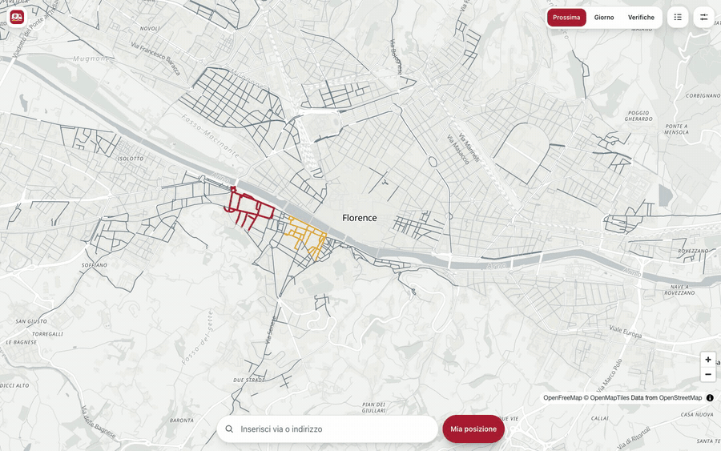
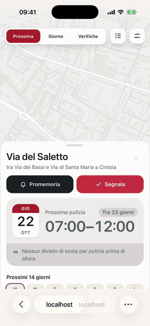

<p align="center">
  
</p>

<h1 align="center">Strade Pulite · Firenze</h1>

<p align="center">
  Quando passa la pulizia strade nella tua via a Firenze: mappa, orari per tratto, promemoria sul calendario e segnalazioni. </br> 
Progetto non ufficiale sugli <a href="https://opendata.comune.fi.it/page_dataset_show?id=pulizia-strade">open data del Comune di Firenze</a>. Fa fede la segnaletica stradale.
</br>
<strong>Stack:</strong> SvelteKit 2 · Svelte 5 · TypeScript · Tailwind CSS 4 · MapLibre GL · Upstash Redis · Vercel
</p>

<p align="center">
  <a href="LICENSE.md"></a>
  <a href="https://opendata.comune.fi.it/page_dataset_show?id=pulizia-strade"></a>
  
  
  
  
</p>

## Anteprima

**Desktop:** cerca una via e vedi subito quando passa la pulizia, tratto per tratto.

<p align="center">
  
</p>

**Telefono:** mappa a tutto schermo e foglio con giorno e orario della prossima pulizia.

<p align="center">
  
</p>

## Avvio in locale

Richiede Node.js 20+.

```sh
git clone https://github.com/giovamuge/puliziastrade.firenze.git
cd puliziastrade.firenze
npm install
npm run dev   # http://localhost:5173
```

Non serve configurazione: dati e segnalazioni restano in memoria. Per le integrazioni, copia `.env.example` in `.env`.

| Comando          |                       |
| ---------------- | --------------------- |
| `npm run check`  | type check            |
| `npm test`       | unit test             |
| `npm run format` | formatta con Prettier |
| `npm run build`  | build di produzione   |

Test d'integrazione sui dati reali:

```sh
curl -o alia_spazzamenti.json https://datigis.comune.fi.it/json/alia_spazzamenti.json
DATA_FILE=alia_spazzamenti.json npx vitest run pipeline
```

## Configurazione

Tutte facoltative.

| Variabile                                                          | Uso                                        |
| ------------------------------------------------------------------ | ------------------------------------------ |
| `KV_REST_API_URL`, `KV_REST_API_TOKEN`                             | Upstash Redis: cache dati e segnalazioni   |
| `CRON_SECRET`                                                      | protegge `/api/cron/refresh`               |
| `RATE_LIMIT_SALT`                                                  | chiave dell'hash anonimo per il rate limit |
| `PUBLIC_SITE_URL`                                                  | dominio per canonical e sitemap            |
| `PUBLIC_OWNER_NAME`, `PUBLIC_OWNER_EMAIL`                          | titolare nell'informativa privacy          |
| `GITHUB_ISSUES_REPO`, `GITHUB_ISSUES_TOKEN`, `GITHUB_ISSUES_LABEL` | copia le segnalazioni come issue           |

**Deploy:** importa il repository su Vercel, collega Upstash (Redis, piano Free, Francoforte) da _Storage_, imposta le variabili.

## Contribuire

Apri una [issue](https://github.com/giovamuge/puliziastrade.firenze/issues) per bug e proposte, poi una pull request da un branch `feat/…` o `fix/…`.

Prima della pull request:

- [ ] `npm run format` (Prettier: tab, doppi apici, 80 colonne)
- [ ] `npm run check && npm test && npm run build` senza errori
- [ ] testi in `src/lib/i18n/`, in tutte e 5 le lingue
- [ ] logica in `src/lib/domain/`, con test `*.test.ts`
- [ ] navigabile da tastiera, contrasti AA in entrambi i temi
- [ ] nuove dipendenze con licenza permissiva (MIT preferita)
- [ ] commit nella forma `feat: …` / `fix: …`

## Licenza

Il codice è distribuito con licenza [PolyForm Noncommercial 1.0.0](LICENSE.md): chiunque può usarlo, modificarlo e ridistribuirlo per scopi non commerciali (uso personale, studio, enti pubblici, associazioni). L'uso commerciale non è consentito. I contributi sono accettati con la stessa licenza.

- Dati: Comune di Firenze / Alia, [CC BY-NC-SA 4.0](https://creativecommons.org/licenses/by-nc-sa/4.0/)
- Logo: [CC BY-SA 4.0](https://creativecommons.org/licenses/by-sa/4.0/), giglio da [Firenze giglio gotico antico](https://commons.wikimedia.org/wiki/File:Firenze_giglio_gotico_antico.svg) di Horemhat
- Mappa: © contributori [OpenStreetMap](https://www.openstreetmap.org/copyright)
